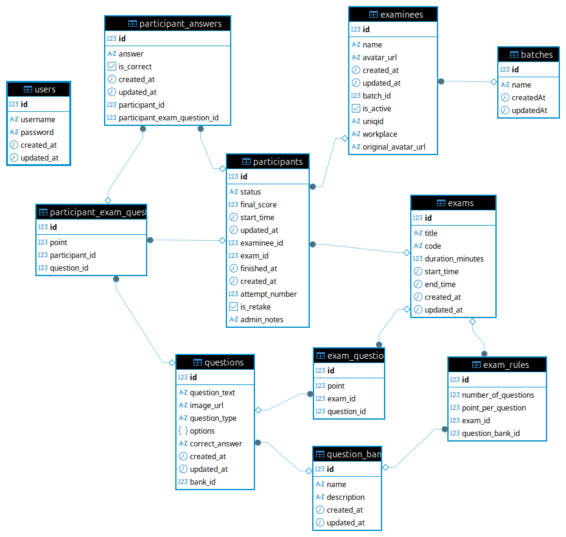

# VIOLET (Virtual Integrated Online Evaluation Tool)

**Sistem Ujian Berbasis Komputer (CBT) Realtime Generasi Baru**

VIOLET adalah platform CBT (Computer Based Test) yang dirancang untuk stabilitas tinggi, keamanan, dan pengalaman pengguna yang premium. Sistem ini memastikan ujian berjalan lancar bahkan dalam kondisi jaringan yang tidak stabil berkat fitur _Resilience_ dan sinkronisasi otomatis.

---

## 🛠 Teknologi (Tech Stack)

Dibangun dengan teknologi modern untuk performa maksimal:

### **Frontend**

- **Framework**: [Next.js 15](https://nextjs.org/) (App Router) - Performa tinggi dan SEO friendly.
- **UI Library**: [Mantine UI v7](https://mantine.dev/) - Komponen antarmuka yang estetis dan responsif.
- **Styling**: TailwindCSS - Utilitas styling yang fleksibel.
- **Realtime Client**: Socket.io-client - Komunikasi dua arah instan.
- **Animasi**: Framer Motion - Transisi halaman dan elemen yang halus.

### **Backend**

- **Framework**: [NestJS](https://nestjs.com/) - Arsitektur backend modular dan scalable.
- **Database**: PostgreSQL 15 - Penyimpanan data relasional yang handal.
- **ORM**: TypeORM - Manajemen database yang aman dan terstruktur.
- **Realtime Gateway**: Socket.io - Menangani ribuan koneksi konkuren.
- **Queue & Event**: (Implied/Planned) Kafka (sebagai opsi untuk skala besar).

### **Infrastruktur**

- **Container**: Docker & Docker Compose - Penyebaran aplikasi yang konsisten.

---

## ✨ Fitur Unggulan

### 1. Sistem Ujian Tahan Banting (Resilience System)

Fitur paling kritis dari VIOLET adalah kemampuannya menangani gangguan koneksi:

- **Blocking Overlay**: Jika koneksi internet siswa terputus atau server down, layar ujian akan otomatis terkunci dengan pesan "Koneksi Terputus". Ini mencegah siswa menjawab soal yang tidak akan tersimpan.
- **Auto-Recovery**: Segera setelah koneksi pulih, sistem otomatis menyinkronkan ulang dan membuka kunci layar tanpa perlu refresh halaman manual.
- **Data Consistency**: Status jawaban disinkronkan secara realtime dengan indikator visual (Saving, Saved, Error).

### 2. Antarmuka Ujian Siswa (Live Exam)

Didesain untuk fokus dan kemudahan:

- **Navigasi Cepat**: "Drawer Navigasi" memungkinkan siswa melompat ke nomor soal mana pun.
- **Indikator Status**: Penanda warna untuk soal yang:
  - 🟣 **Aktif**: Sedang dikerjakan.
  - 🟣 (Solid) **Dijawab**: Sudah dipilih jawabannya.
  - ⚪ **Belum**: Belum dikerjakan.
- **Timer Server-Side**: Waktu hitung mundur disinkronkan dengan server, mencegah manipulasi waktu di sisi klien.

### 3. Dashboard Admin Komprehensif

Pusat kendali untuk instruktur/admin dengan fitur manajemen lengkap dari bank soal hingga monitoring realtime.

---

## 📖 Panduan Pengguna

### A. Untuk Admin (Guru/Pengawas)

VIOLET memiliki panel admin yang kuat untuk mengelola seluruh siklus ujian.

#### 1. Manajemen Batch (Kelas)

Kelompokkan siswa ke dalam kelas/batch untuk kemudahan pengelolaan.

- **Buat Batch**: Tambahkan nama batch (misal: "XII IPA 1", "Gelombang 1").
- **Status Aktif/Nonaktif**: Anda dapat menonaktifkan satu batch sekaligus. Saat batch dinonaktifkan, seluruh siswa di dalamnya tidak akan bisa login. Ini berguna untuk memblokir akses setelah ujian selesai.

##### Detail Analisis Batch

Klik nama batch untuk masuk ke dashboard spesifik kelas tersebut.

1. **Grafik Interaktif**:
   - **Rata-rata per Ujian**: Melihat tren nilai ujian dari waktu ke waktu.
   - **Papan Skor (Leaderboard)**: Ranking siswa berdasarkan akumulasi nilai.
   - **Performa per Ujian**: Analisis distribusi nilai untuk satu ujian spesifik.
2. **Laporan & Ekspor**:
   - **Cetak PDF**: Unduh laporan rapor kelas siap cetak.
   - **Export Excel**:
     - **Lengkap**: Berisi nilai 0-100 (Normalisasi) dan skor asli (misal 53/60).
     - **Hanya Normalisasi**: Nilai akhir skala 100.
     - **Hanya Skor Asli**: Skor mentah.
3. **Data Peserta**: Tabel lengkap dengan history ujian tiap siswa. Klik tombol "Lihat Riwayat" untuk drill-down ke profil siswa individu.

#### 2. Manajemen Peserta

- **Quick Import (Smart Paste)**:
  - Copy-paste daftar nama dari Excel/Notepad (satu nama per baris).
  - **Fitur Magic Image**: Drag & drop foto siswa ke panel. Sistem otomatis mencocokkan foto dengan nama siswa jika nama file sama (misal: `Budi.jpg` -> `Budi`).
  - Penomoran otomatis dibersihkan (misal: `1. Budi` -> `Budi`).
- **Avatar Kustom**: Upload manual satu per satu juga tersedia.
- **Kartu Peserta**: (Segera Hadir) Cetak kartu peserta dengan QR Code untuk login cepat.

#### 3. Bank Soal & Manajemen Soal

Sebelum membuat ujian, Anda perlu membuat bank soal.

- **Bank Soal**: Wadah untuk mengelompokkan soal (misal: "Matematika Dasar 2024").
- **Jenis Soal**: Pilihan Ganda (Single Choice).
- **Multimedia**: Mendukung gambar per soal (via Upload atau Quick Import).

##### Fitur Quick Import (Smart Paste)

Anda dapat menyalin soal dari dokumen Word/Text langsung ke aplikasi.
**Format yang Didukung:**

1. **Kunci Jawaban Inline (Disarankan)**:
   Tambahkan tanda `;` atau `**` di akhir jawaban benar.
   ```text
   1. Ibukota Indonesia adalah...
   A. Bandung
   B. Jakarta;
   ```
2. **Kunci Jawaban Blok (Di Bawah)**:
   ```text
   ... (soal-soal) ...
   Answer:
   1. B
   2. A
   ```
3. **Format Standar**:
   ```text
   1. Apa nama ibukota Jawa Barat?
   a. Bandung
   b. Semarang
   ```
   _(Sistem akan meminta kunci jawaban manual jika tidak terdeteksi)_

##### Fitur Lainnya:

- **Ekspor Dokumen**: Unduh bank soal ke format **.docx (Word)** atau **.pdf**.
- **Aksi Massal**: Hapus banyak soal sekaligus dengan mencentang checkbox.

#### 4. Manajemen Jadwal Ujian

Saat membuat ujian baru, Anda memiliki fleksibilitas penuh:

- **Judul & Kode**: Tentukan kode unik (misal: `MATH-FINAL`) yang akan digunakan siswa untuk login.
- **Waktu**: Set waktu mulai dan selesai.
  > **Tips**: Jika ingin ujian bisa diakses kapan saja (tanpa jadwal kaku), kosongkan waktu mulai/selesai. Ujian akan berstatus **"Selalu Aktif"**.
- **Mode Soal**:
  - **Manual**: Pilih soal speisifik satu per satu dari berbagai bank soal.
  - **Acak (Random)**: Tentukan aturan (misal: "Ambil 10 soal dari Bank A, 5 soal dari Bank B"). Setiap siswa akan mendapat paket soal yang berbeda namun setara.

#### 5. Monitoring & Live Proctoring

Halaman ini adalah pusat komando saat ujian berlangsung:

- **Live Leaderboard**: Skor peserta muncul secara realtime saat mereka menjawab (tanpa perlu refresh). Urutan otomatis berdasarkan skor tertinggi dan waktu tercepat.
- **Status Pengerjaan**:
  - 🟢 **Mengerjakan**: Siswa sedang online dan aktif.
  - ⚫ **Selesai**: Siswa sudah submit atau waktu habis.
- **Durasi Realtime**: Melihat berapa lama siswa mengerjakan soal.
- **Aksi Kontrol**:
  - **Retake (Ujian Ulang)**: Jika siswa mengalami kendala fatal, Anda bisa mereset sesi mereka. Data lama akan diarsipkan sebagai _Attempt #1_, dan mereka bisa mulai lagi.
  - **Paksa Selesai**: Menghentikan ujian siswa secara paksa jika terjadi kecurangan.
- **Ekspor Laporan**: Unduh hasil ujian ke dalam format **Excel (.xlsx)** lengkap dengan rincian waktu mulai, selesai, dan durasi. Bisa difilter berdasarkan Batch atau Tanggal.

---

### B. Untuk Peserta Ujian (Siswa)

#### 1. Masuk ke Ujian (Login)

1. Buka halaman utama aplikasi.
2. Pada kolom **"Pilih Nama Anda"**, ketik atau pilih nama Anda dari daftar.
3. Masukkan **Kode Ujian** yang diberikan oleh pengawas.
4. Klik **"Gabung Ujian"**.

#### 2. Mengerjakan Ujian

- **Menjawab Soal**: Klik opsi A/B/C/D/E. Perhatikan indikator:
  - 🔄 _Spinner_: Sedang dikirim.
  - ✅ _Checklist_: **TERSERSIMPAN** di server.
  - ⚠️ _Merah_: Gagal simpan (Cek koneksi!).
- **Navigasi**: Gunakan tombol "Daftar Soal" untuk melihat sitemap soal.
- **Selesai**: Klik tombol "Selesai" dan konfirmasi untuk mengakhiri ujian.

#### 3. Indikator Sinyal (PENTING)

- Jika layar terkunci merah bertuliskan **"Koneksi Terputus"**, **JANGAN Refresh/Tutup Browser**.
- Tunggu hingga sinyal kembali, sistem akan otomatis melanjutkan sesi Anda tanpa data hilang.

---

## ⚙️ Prasyarat

- **Node.js**: v18.0.0 atau lebih tinggi
- **Docker & Docker Compose**: Untuk menjalankan database.

## 🚀 Cara Setup

### 1. Setup Database

Jalankan container PostgreSQL:

```bash
docker-compose up -d
```

Ini akan memulai instance PostgreSQL pada port `5432` dengan user `admin` dan password `password` (konfigurasi default).

### 2. Setup Backend

Masuk ke direktori backend dan install dependencies:

```bash
cd backend/api
npm install
```

Konfigurasi Variabel Lingkungan (.env):
Buat file `.env` di `backend/api/` dengan isi berikut (sesuaikan jika perlu):

```env
DB_HOST=localhost
DB_PORT=5432
DB_USERNAME=admin
DB_PASSWORD=password
DB_DATABASE=cbt_db
JWT_SECRET=supersecretkey123
```

Jalankan Backend:

```bash
# Mode Development
npm run start:dev
```

API akan berjalan di `http://localhost:3000` (port default NestJS).

### 3. Setup Frontend

Masuk ke direktori frontend:

```bash
cd frontend
npm install
```

Konfigurasi Variabel Lingkungan (.env.local):
Buat file `.env.local` di `frontend/` dengan isi berikut (sesuaikan jika perlu):

```env
NEXT_PUBLIC_API_URL=http://localhost:3000
```

Jalankan Frontend:

```bash
# Development server
npm run dev
```

Aplikasi akan tersedia di `http://localhost:3001` (dikonfigurasi di `package.json`).

## 📁 Struktur Proyek

```
violet/
├── backend/
│   └── api/          # Aplikasi Backend NestJS
│       └── src/      # (Modules: Users, Exams, LiveExam, dll.)
├── frontend/         # Aplikasi Frontend Next.js
│   └── src/          # (App Router, Components, dll.)
├── docker-compose.yml # Infrastruktur Database
└── Rencana fitur tambahan.txt # Peta Jalan/Rencana Fitur
```

---

## 🗄️ Skema Database



Berikut adalah dokumentasi detail mengenai entitas database (tabel) dalam sistem CBT Realtime.

### 1. User Management

#### `users` (User)

Tabel ini digunakan untuk menyimpan data administrator atau pengawas ujian.

- **File**: `src/users/entities/user.entity.ts`
- **Key Fields**:
  - `username`: String, unik.
  - `password`: String (hashed).
- **Fungsi**: Otentikasi untuk akses dashboard admin.

#### `examinees` (Examinee)

Tabel induk untuk data peserta ujian (siswa/kandidat).

- **File**: `src/examinees/entities/examinee.entity.ts`
- **Key Fields**:
  - `name`: Nama lengkap.
  - `uniqid`: String, unik (misal: NIS/NIM/No Peserta).
  - `batch_id`: Foreign Key ke tabel `batches`.
  - `is_active`: Boolean, status aktif peserta.
- **Relasi**:
  - `ManyToOne` ke `Batch`: Satu peserta masuk dalam satu batch.
  - `OneToMany` ke `Participant`: Satu peserta bisa mengikuti banyak ujian.

#### `batches` (Batch)

Tabel pengelompokan peserta.

- **File**: `src/batches/entities/batch.entity.ts`
- **Key Fields**:
  - `name`: Nama batch (misal: "Kelas XII IPA 1", "Gelombang 1").
- **Relasi**:
  - `OneToMany` ke `Examinee`.

---

### 2. Exam Master Data (Bank Soal & Ujian)

#### `question_banks` (QuestionBank)

Mengelompokkan soal ke dalam kategori atau topik.

- **File**: `src/question-banks/entities/question-bank.entity.ts`
- **Key Fields**:
  - `name`: Nama bank soal.
  - `description`: Deskripsi topik.
- **Relasi**:
  - `OneToMany` ke `Question`.

#### `questions` (Question)

Menyimpan butir soal individual.

- **File**: `src/questions/entities/question.entity.ts`
- **Key Fields**:
  - `question_text`: Isi pertanyaan.
  - `question_type`: Enum (saat ini `MULTIPLE_CHOICE`).
  - `options`: JSONB. Menyimpan opsi jawaban (misal: `[{key: 'A', text: '...'}, ...]`).
  - `correct_answer`: Kunci jawaban (misal: 'A').
  - `bank_id`: Foreign Key ke `question_banks`.
- **Catatan**: Kolom `options` menggunakan tipe data `jsonb` yang fleksibel untuk menyimpan struktur pilihan ganda.

#### `exams` (Exam)

Definisi konfigurasi ujian.

- **File**: `src/exams/entities/exam.entity.ts`
- **Key Fields**:
  - `title`: Judul ujian.
  - `code`: Kode unik ujian untuk akses.
  - `duration_minutes`: Durasi pengerjaan.
  - `start_time` & `end_time`: Jendela waktu ujian bisa diakses.
- **Relasi**:
  - `OneToMany` ke `ExamRule`: Aturan komposisi soal.
  - `OneToMany` ke `ExamQuestion`: Soal-soal spesifik (fixed).

#### `exam_rules` (ExamRule)

Menentukan komposisi soal ujian secara dinamis (randomizer).

- **File**: `src/exams/entities/exam-rule.entity.ts`
- **Key Fields**:
  - `exam_id`: Link ke ujian.
  - `question_bank_id`: Link ke sumber bank soal.
  - `number_of_questions`: Jumlah soal yang harus diambil dari bank ini.
  - `point_per_question`: Bobot nilai per soal.
- **Fungsi**: Memungkinkan skenario "Ambil 10 soal Matematika (poin 5) dan 10 soal Bahasa Inggris (poin 5)" dalam satu ujian.

#### `exam_questions` (ExamQuestion)

Menyematkan soal spesifik ke ujian (opsi manual/fixed).

- **File**: `src/exams/entities/exam-question.entity.ts`
- **Relasi**: Menghubungkan `Exam` dan `Question` secara langsung dengan poin tertentu.

---

### 3. Exam Execution (Transaksi Ujian)

#### `participants` (Participant)

Mencatat sesi ujian seorang peserta. Ini adalah tabel inti saat ujian berjalan.

- **File**: `src/participants/entities/participant.entity.ts`
- **Key Fields**:
  - `examinee_id` & `exam_id`: Siapa yang ujian dan ujian apa.
  - `status`: Enum (`started`, `finished`).
  - `final_score`: Nilai akhir.
  - `attempt_number`: Hitungan percobaan (untuk fitur remedial/retake).
  - `is_retake`: Flag apakah ini ujian ulang.
- **Constraint**: `Unique(['examinee', 'exam', 'attempt_number'])` memastikan peserta tidak bisa double entry untuk percobaan yang sama.

#### `participant_exam_questions` (ParticipantExamQuestion)

Snapshat daftar soal yang didapat peserta.

- **File**: `src/participants/entities/participant-exam-question.entity.ts`
- **Fungsi**:
  - Ketika ujian dimulai, sistem meng-generate soal berdasarkan `ExamRule` atau `ExamQuestion`.
  - Hasil generate disimpan di sini agar **konsisten**. Jika peserta refresh browser, soal yang didapat tetap sama, tidak teracak ulang.
- **Relasi**: Link tabel `participants` dengan tabel master `questions`.

#### `participant_answers` (ParticipantAnswer)

Menyimpan jawaban peserta.

- **File**: `src/participants/entities/participant-answer.entity.ts`
- **Key Fields**:
  - `participant_id`: Link ke sesi peserta.
  - `participant_exam_question_id`: Link ke butir soal spesifik peserta.
  - `answer`: Jawaban yang dipilih (misal: 'B').
  - `is_correct`: Status kebenaran jawaban.
- **Fungsi**: Mencatat progres pengerjaan real-time.
